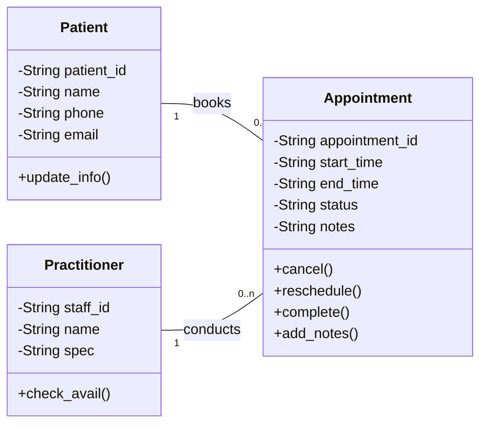

### A - Requirements Review
#### Highlight nouns, verbs and business rules in SmartCare v0.2.
##### Nouns
- Patient
- Practitioner
- Appointment
- Clinic
- Schedule
- Status <br/>
##### Verbs
- Book
- Cancel
- Reschedule
- View
- Update <br />
##### Business Rules
- A patient may have multiple appointments.
- An appointment must be associated with exactly one practitioner.
- A cancelled appointment cannot be marked as completed.
- Patients can only book available time slots. <br />

### B - Candidate Classes
#### Record candidate concepts, supporting requirements, state and behaviour.
| Candidate Class               | Supporting Requirements                                       | State                             | Behaviour                                         |
| ----------------------------- |---------------------------------------------------------------|------------------------------------------------| --------------------------------------------------------------------------- |
| **Patient**                   | Patients can book, view, cancel, and reschedule appointments. | patient_Id, name, phone, email, address        | bookAppointment(), cancelAppointment(), viewAppointments(), updateDetails() |
| **Practitioner**              | Practitioners manage schedules and conduct appointments.      | practitioner_Id, name, specialty, availability | viewSchedule(), acceptAppointment(), updateAvailability()                   |
| **Appointment**               | The system stores appointment details and status.             | appointment_Id, date, time, status             | schedule(), cancel(), reschedule(), updateStatus()                          |
| **Clinic**                    | The clinic managers practitioners and appointments.           | clinic_Id, name, address, contact_No           | addPractitioner(), manageAppointments(), viewSchedule()                     |

### C - CRC Cards
#### Create CRC cards for Patient, Practitioner and Appointment.
##### Patient
| Responsibilities	| Collaborators |
|----------------|-------------|
| Maintain personal and contact information | Appointment |
| Book appointments with practitioners | Practitioner, Appointment |
| Cancel or reschedule appointments	| Appointment |
| View appointment history and status | Appointment |

##### Practitioner
| Responsibilities	                      | Collaborators        |
|----------------------------------------|----------------------|
| Maintain practitioner details          | Clinic               |
| Manage appointment                     | Appointment          |
| Accept or reject appointment requests  | Appointment, Patient |
| View patient appointment information   | Appointment, Patient |

##### Appointment
| Responsibilities	| Collaborators |
|----------------|-------------|
| Store appointment date, time, and status | Patient, Practitioner |
| Link a patient with a practitioner | Patient, Practitioner |
| Update appointment status	| Patient, Practitioner |

##### CRC Relationship Summary
- Patient collaborates primarily with Appointment to create, modify, and view bookings.
- Practitioner collaborates with Appointment to manage availability and scheduled consultations.
- Appointment acts as the central class connecting Patient and Practitioner, storing information about their relationship (date, time, and status).

### D - UML Model
#### Draw classes, attributes, operations, associations and multiplicities.


### E - AI Design Review
#### Ask AI to suggest classes and relationships using only confirmed requirements; require supporting requirement IDs.
Based strictly on the confirmed requirements, the most defensible domain model contains four classes only: <br />
- Patient
- Practitioner
- Appointment
- Clinic <br />
with associations centered on Appointment, and no manager/controller/database classes included in the analysis model because they are design decisions rather than requirement-derived domain concepts. <br />

### F - Compare and Decide
#### Record at least one accepted, modified and rejected AI suggestion.
##### Accepted Suggestion:
- Suggestion: Patient, Practitioner, and Appointment should be domain classes.
- Decision: Accepted
- Reason: These concepts appear directly in the requirements and represent key business entities. They have their own attributes, behaviours, and relationships.<br />
##### Modified Suggestion:
- Suggestion: CancellationStatus should be a class.
- Decision: Modified
- Modification: CancellationStatus was changed from a class to an attribute of Appointment.
- Reason: The requirements mention appointment cancellation but do not describe cancellation as an independent business object. A status value such as Scheduled, Cancelled, or Completed can be stored within the Appointment class.<br />
##### Rejected Suggestion:
- Suggestion: AppointmentManager should be included as a class.
- Decision: Rejected
- Reason: AppointmentManager is a design or implementation concept rather than a domain concept. The requirements identify appointments but do not mention managers, controllers, or service classes. Following requirements-driven analysis, only business-domain classes should be included at this stage.<br />

### G - Python Skeletons
#### Create simple Patient, Practitioner and Appointment class skeletons.
```
class Patient:
    def __init__(self, patient_id, name, contact_details):
        self.patient_id = patient_id
        self.name = name
        self.contact_details = contact_details

    def book_appointment(self, appointment):
        pass

    def cancel_appointment(self, appointment):
        pass


class Practitioner:
    def __init__(self, practitioner_id, name, specialty):
        self.practitioner_id = practitioner_id
        self.name = name
        self.specialty = specialty

    def view_schedule(self):
        pass


class Appointment:
    def __init__(self, appointment_id, date_time, patient, practitioner):
        self.appointment_id = appointment_id
        self.date_time = date_time
        self.patient = patient
        self.practitioner = practitioner
        self.status = "Scheduled"

    def cancel(self):
        pass

    def reschedule(self, new_date_time):
        pass
```

### H - Consistency Check
#### Check model-code consistency; do not implement full behaviour yet.
<p>The Python skeletons are largely consistent with the requirements-based domain model:<br />
- Correct domain classes (Patient, Practitioner, Appointment)
- Correct appointment-centred associations
- Appropriate attributes
- Method stubs match identified responsibilities
- No unsupported manager/controller classes </p>
<p>Clinic exists in the conceptual model but is not yet represented in code.</p>
<p>Since the task was to create skeletons only for Patient, Practitioner, and Appointment, this gap is acceptable and does not indicate a model-code inconsistency.</p>

### Reflection
#### What modelling decision was hardest? Where did AI over-design? What evidence supported your final choices?
##### What modelling decision was hardest?
<p>The most difficult modelling decision was determining whether CancellationStatus should be modelled as a separate class or as an attribute of Appointment. Initially, it seemed possible to create a dedicated class because cancellation is an important part of the system. However, the requirements only mention cancelling appointments and do not describe cancellation as an independent object with its own data or behaviour. Therefore, the final decision was to model status as an attribute within the Appointment class rather than introducing an additional class.</p>

##### Where did AI over-design?
<p>The AI over-designed the model by suggesting implementation-oriented classes such as:<br />
- PatientManager
- PractitionerManager
- AppointmentManager
- NotificationManager
- ScheduleEngine</p>
<p>These classes describe possible software solutions rather than business-domain concepts. At the analysis stage, the focus should be on entities identified from the requirements. Adding manager or controller classes too early increases complexity and introduces assumptions that are not supported by the specification.</p>
<p>The AI also suggested CancellationStatus as a standalone class, which added unnecessary detail without supporting requirements.</p>

##### What evidence supported your final choices?
The final model was based on direct evidence from the confirmed requirements:

| Class        | Evidence from Requirements                                                                         |
| ------------ | -------------------------------------------------------------------------------------------------- |
| Patient      | Patients register, book appointments, and cancel appointments.                                     |
| Practitioner | Practitioners are assigned to and conduct appointments.                                            |
| Appointment  | Appointments are created, scheduled, rescheduled, and cancelled.                                   |
| Clinic       | The system operates within a clinic context and manages patients, practitioners, and appointments. |

The relationships were also supported by the requirements:<br />
- A Patient can have multiple Appointments.
- A Practitioner can be associated with multiple Appointments.
- Each Appointment is linked to one Patient and one Practitioner.
- The Clinic maintains records of patients, practitioners, and appointments.
<p>Classes such as PatientManager and AppointmentManager were rejected because no requirement explicitly referred to them. Following a requirements-driven approach ensured that every class and relationship could be traced back to a documented requirement rather than assumptions or implementation preferences.</p>
