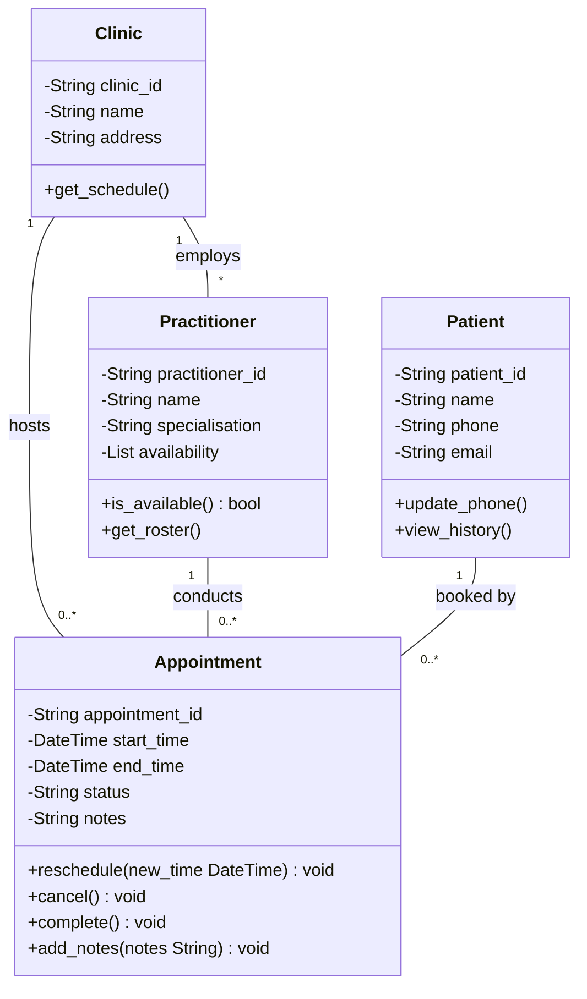

### Requirement-to-Concept Trace

| Requirement                                                  | Concept                            | State / Behaviour                               | Decision                                                 |
| ------------------------------------------------------------ | ---------------------------------- | ----------------------------------------------- | -------------------------------------------------------- |
| Patients register with the clinic                            | Patient, Clinic                    | Patient details (ID, name, contact details)     | Accepted as domain classes                               |
| Patients can book appointments with practitioners            | Patient, Appointment, Practitioner | `book_appointment()`; appointment date/time     | Accepted as core domain classes and relationships        |
| Practitioners manage their schedules and attend appointments | Practitioner, Appointment          | `view_schedule()`; practitioner specialty       | Accepted as domain concepts                              |
| Appointments can be rescheduled                              | Appointment                        | `reschedule()`; appointment date/time           | Accepted as Appointment behaviour                        |
| Appointments can be cancelled                                | Appointment                        | `cancel()`; appointment status                  | Accepted behaviour; status modelled as an attribute      |
| Appointment cancellation information must be stored          | CancellationStatus                 | Status value such as "Scheduled" or "Cancelled" | Modified: attribute of Appointment, not a separate class |
| AppointmentManager                                           | N/A                                | N/A                                             | Rejected: implementation/design class                    |
| PatientManager                                               | N/A                                | N/A                                             | Rejected: implementation/design class                    |
| PractitionerManager                                          | N/A                                | N/A                                             | Rejected: implementation/design class                    |
| NotificationManager                                          | N/A                                | N/A                                             | Rejected: notifications not mentioned in requirements    |
| ScheduleEngine                                               | N/A                                | N/A                                             | Rejected: technical solution rather than domain concept  |

### CRC Cards
#### Class: Patient
| Responsibilities	| Collaborators |
|----------------|-------------|
| Maintain personal and contact information | Appointment |
| Book appointments with practitioners | Practitioner, Appointment |
| Cancel or reschedule appointments	| Appointment |
| View appointment history and status | Appointment |

#### Class: Practitioner
| Responsibilities	                      | Collaborators        |
|----------------------------------------|----------------------|
| Maintain practitioner details          | Clinic               |
| Manage appointment                     | Appointment          |
| Accept or reject appointment requests  | Appointment, Patient |
| View patient appointment information   | Appointment, Patient |

#### Class: Appointment
| Responsibilities	| Collaborators |
|----------------|-------------|
| Store appointment date, time, and status | Patient, Practitioner |
| Link a patient with a practitioner | Patient, Practitioner |
| Update appointment status	| Patient, Practitioner |

#### Optional Class: Clinic
| Responsibilities                    | Collaborators                      |
| ----------------------------------- | ---------------------------------- |
| Maintain registered patients        | Patient                            |
| Maintain practitioner records       | Practitioner                       |
| Maintain appointment records        | Appointment                        |
| Provide clinic context for bookings | Patient, Practitioner, Appointment |

### UML Class Diagram

### Design Rationale

The model uses associations rather than inheritance because the classes describe different concepts:

- A Patient has appointments.
- A Practitioner conducts appointments.
- An Appointment links one patient with one practitioner.

Inheritance was rejected because an appointment is not a type of patient or practitioner. The relationships are therefore "has-a" relationships rather than "is-a" relationships.

The multiplicities were chosen directly from the requirements:

- One Patient can have many Appointments over time.
- One Practitioner can conduct many Appointments.
- Each Appointment is associated with exactly one patient and one practitioner.

These multiplicities best reflect normal clinic operations and are supported by the booking requirements.

AI Design Review Record

| AI Suggestion                                 | Evidence                                                                            | Decision            | Reason                                                                               | Model Change                                                                   |
| --------------------------------------------- | ----------------------------------------------------------------------------------- | ------------------- | ------------------------------------------------------------------------------------ | ------------------------------------------------------------------------------ |
| Patient should be a domain class              | Requirements describe patients registering, booking, and cancelling appointments   | Accepted            | Patient is a core business entity with its own data and responsibilities             | Added **Patient** class                                                        |
| Practitioner should be a domain class         | Requirements describe practitioners being assigned to and conducting appointments   | Accepted            | Practitioner is a key domain concept with identifiable attributes and behaviours     | Added **Practitioner** class                                                   |
| Appointment should be a domain class          | Requirements focus on booking, rescheduling, and cancelling appointments           | Accepted            | Appointment is the central business object of the system                             | Added **Appointment** class                                                    |
| CancellationStatus should be a separate class | Requirements only mention appointment cancellation; no independent cancellation entity exists | Modified            | Cancellation represents a property of an appointment rather than a standalone object | Replaced **CancellationStatus class** with **status attribute** in Appointment |
| Clinic should be included in the model        | Requirements refer to patients and practitioners operating within a clinic context  | Accepted (Optional) | Provides context for managing patients, practitioners, and appointments              | Added optional **Clinic** class and associations                               |
| AppointmentManager should be a class          | No requirement refers to managers, controllers, or service objects                  | Rejected            | Represents an implementation decision rather than a domain concept                   | No change                                                                      |
| PatientManager should be a class              | No supporting requirement                                                           | Rejected            | Not part of the business domain model                                                | No change                                                                      |
| PractitionerManager should be a class         | No supporting requirement                                                           | Rejected            | Analysis should focus on domain entities only                                        | No change                                                                      |
| NotificationManager should be a class         | Requirements do not mention notifications or reminders                              | Rejected            | Unsupported by evidence from requirements                                            | No change                                                                      |
| ScheduleEngine should be a class              | Requirements mention schedules but not a scheduling engine                          | Rejected            | Technical solution rather than a business concept                                    | No change                                                                      |